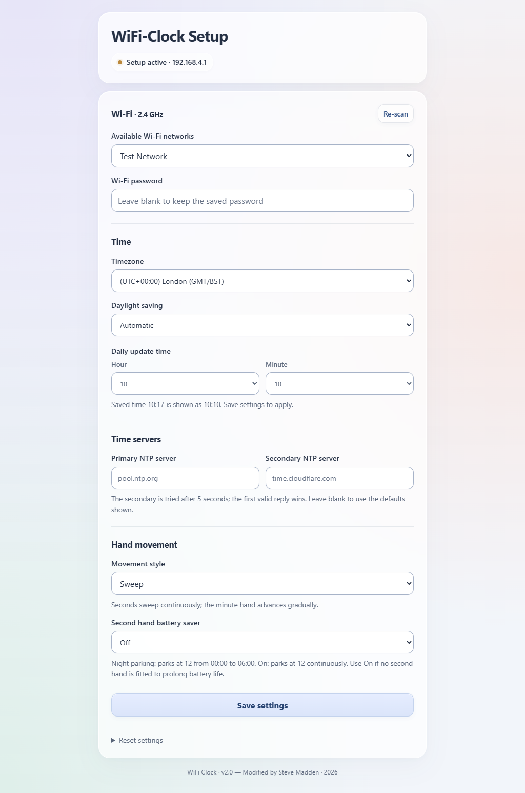

# Chouchin-899 · WiFi Clock v2.0

Wi-Fi time synchronisation, configurable hand movement and a simple local settings page.

**Check your board first:** this project is for **HC32L130J8TA + TXW813-320** only. For **MM32 + ESP8285**, use [the older-board project](https://github.com/maddenste/Chouchin-CH899-Firmware). The firmware is not interchangeable.

## Ready to install?

**[Start here: equipment, software and flashing steps →](docs/GETTING_STARTED.md)**

No compiling or firmware editing is required. Install the two prepared files, then enter your Wi-Fi settings.

- [Firmware downloads and checksums](https://github.com/maddenste/Chouchin-899-latest-revision/releases/tag/v2.0-rc1)
- [Three-page user manual](docs/WiFi-Clock-User-Manual-v2.0.pdf)
- [Flashing help](docs/TROUBLESHOOTING.md)

We used Windows. Other systems may work with suitable tools, but are untested; the supplied flashing script is Windows-specific.

## Make it your clock

- Wi-Fi network, two NTP servers, timezone and daylight saving rules.
- Daily updates in ten-minute steps, plus an extra wake for DST changes.
- Sweep, Burst or Hold&Start hand movement.
- Second hand battery saver: Off, Night parking or On.

Hold&Start recreates the characteristic Swiss railway station-clock motion: the seconds hand pauses at 12, then restarts as the minute hand advances.

[Research, source notes and test results](docs/BACKGROUND.md) are available separately.

Unofficial project · WiFi Clock v2.0 — Modified by Steve Madden · 2026.
