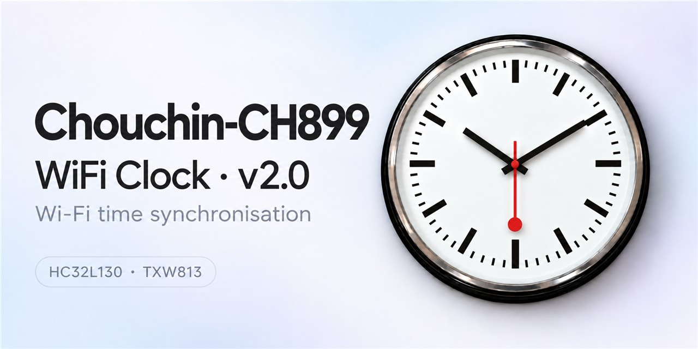

# Chouchin-CH899 · WiFi Clock v2.0

Wi-Fi time synchronisation, configurable hand movement and a simple local settings page.

**Check your board first:** this project is for **HC32L130J8TA + TXW813-320** only. For **MM32 + ESP8285**, use [the older-board project](https://github.com/maddenste/Chouchin-CH899-Firmware). The firmware is not interchangeable.

[Example Chouchin-CH899 Wi-Fi clock movement](https://www.hr-clockparts.com/clock-movement/wifi-clock-movement.html) — for identification only, not a confirmed compatible purchase. The listing does not identify the board revision; check for **HC32L130J8TA + TXW813-320** before buying for this project.

## Ready to install?

**[HC32 V21 R3 — physically tested, current release](https://github.com/maddenste/Chouchin-899-latest-revision/releases/tag/nightly-hc32-v21-r3-20261007):** On 8 October 2026, the owner's clock woke at the scheduled **10:00**, flashed red then blue, and continued displaying the correct time with no noticeable hand jump or full-turn calibration. This observed daily-wake behaviour passed physical testing; other settings and long-term reliability are not claimed as fully validated. Wi-Fi R17 is unchanged.

Install **Chouchin-899-HC32-V21-R3-NIGHTLY-20261007.hex**. The original filename and release tag are retained to identify the exact tested image; the release is no longer an experimental prerelease. V15 is retired and its release/downloads have been removed following repeated unwanted calibration and late Wi-Fi wake observations.

If you experience any bugs or unexpected behaviour, please [let me know through GitHub Issues](https://github.com/maddenste/Chouchin-899-latest-revision/issues). Include your firmware versions, settings and a description of what happened; for a stopped clock, note the hand positions and LED behaviour.

**[Start here: equipment, software and flashing steps →](docs/GETTING_STARTED.md)**

No compiling or firmware editing is required. Install the two prepared files, then enter your Wi-Fi settings.

**Flashing instructions for both chips:** follow the [HC32 flashing guide](docs/HC32.md)
and [Wi-Fi flashing guide](docs/FLASHING.md). The Wi-Fi guide includes a double-click
launcher that guides you through file selection and catching the chip at power-on—no
commands to edit.

- [V21 R3 — tested firmware downloads and checksums](https://github.com/maddenste/Chouchin-899-latest-revision/releases/tag/nightly-hc32-v21-r3-20261007)
- [Current user guide](docs/USER_GUIDE.md)
- [Help / report a problem](docs/TROUBLESHOOTING.md)

We used **Windows 11**. These instructions cover Windows 11; other systems may work with suitable tools, but have not been verified.

## Make it your clock

- Wi-Fi network, two NTP servers, timezone and daylight saving rules.
- Daily updates in ten-minute steps, plus an extra wake for DST changes.
- Sweep, Burst or Hold&Start hand movement.
- Second hand battery saver: Off, Night parking or On.

Hold&Start recreates the characteristic Swiss railway station-clock motion: the seconds hand pauses at 12, then restarts as the minute hand advances.

[Watch an example of the Hold&Start movement](https://youtube.com/shorts/2L59QxfKAD8)

[Research, source notes and test results](docs/BACKGROUND.md) are available separately.

Unofficial project · WiFi Clock v2.0 — Modified by Steve Madden · 2026.
