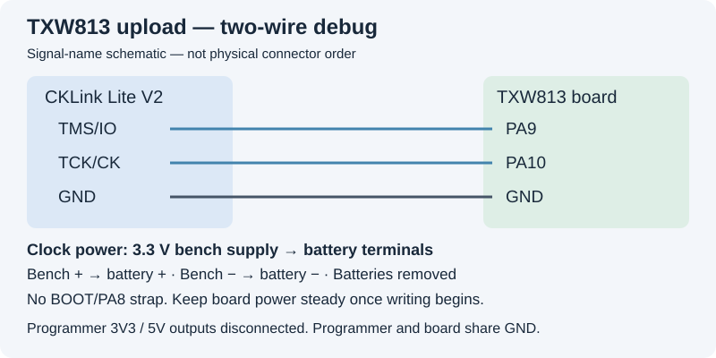

# Flash the Wi-Fi chip

For **TXW813-320 + HC32L130J8TA boards**, using Windows and CKLink Lite.
The [HC32 chip has separate upload instructions](HC32.md).

Prefer commands? Use the [manual CLI flashing guide](FLASHING_CLI.md).

## Download the launcher

**[Download flashing launcher and scripts (ZIP)](https://github.com/maddenste/Chouchin-899-latest-revision/archive/refs/tags/v2.0.zip)**

Includes **[Flash-WiFi.bat](../Flash-WiFi.bat)** and its required scripts.
**Extract the ZIP**—do not download the BAT on its own.

## 1. Get the software and firmware

Install **C-SKY DebugServer/driver and CDK** from the
[software downloads and algorithm-location guide](TOOLS.md#software-downloads).
Have **TXW81X_FLASH_ALGORITHM.elf** and its matching **.init** file ready.
The launcher uses Windows' built-in PowerShell; no PowerShell installation is needed.

**[Download Wi-Fi R17 firmware (BIN)](https://github.com/maddenste/Chouchin-899-latest-revision/releases/download/v2.0/WiFi-Clock-v2.0-R17-20261003_FULL.bin)**

## 2. Connect with power off

Remove batteries. Connect a regulated **3.3 V supply to the battery terminals**,
positive to **+**, negative to **−**. Check polarity and leave the supply off.

Leave **all other probe pins disconnected**. No BOOT strap is needed.
Plug CKLink into USB, but keep board power off.

## 3. Run Flash-WiFi.bat

Close FlashProgrammer and all DebugServer windows.
Double-click **Flash-WiFi.bat** in the extracted folder.

Select files when prompted. The launcher checks them; press **Enter** when
wired and ready. No commands or paths to edit.

- When connection attempts begin, turn board power **on**.
- If it has not connected, cycle board power. About **five power cycles** was typical.
- The script automatically declines the CKLink update prompt. If it stays open, choose **No**.
- **Once connected, stop cycling power and keep power steady.**

Wait for **WRITTEN: programmer reported Program success**. Writing took around
**90–100 seconds** on our setup; other setups may take longer.

**Red LED warning:** the HC32 controls this LED, so it can keep flashing during
writing or after a missed boot window. **Follow the script's messages, not the
LED. Do not cycle power or unplug the probe during writing.**

To stop a repeating update-window loop **before writing starts**, unplug the
probe from USB, then close the flashing window.

If writing fails, **do not immediately retry**. Keep the logs and follow
[troubleshooting](TROUBLESHOOTING.md). There is no automatic write retry or
flash readback.

## 4. Restart and set up

After **WRITTEN**, power off and remove the probe connections. Restart normally.
Join **WiFi-Clock-Setup**, open **http://192.168.4.1/** and save your settings.
Old settings are cleared by this installation.

[Detailed help](FLASHING_HELP.md) · [Manual command-line alternative](FLASHING_CLI.md) ·
[User manual](WiFi-Clock-User-Manual-v2.0.pdf)
