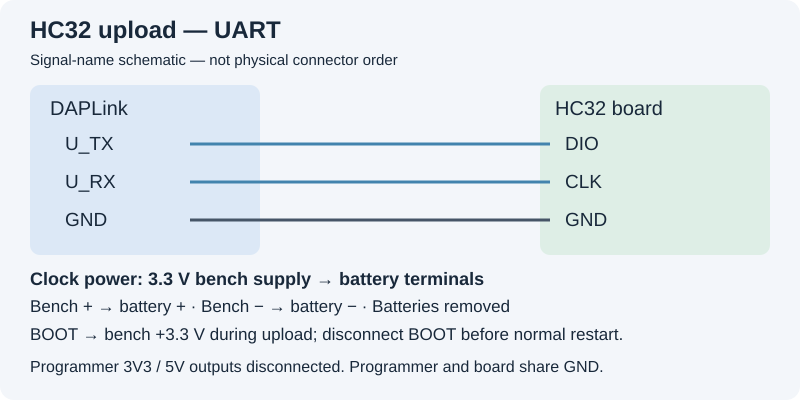

# Upload HC32 V15 — movement controller

[Start here](GETTING_STARTED.md) · [Equipment/software](TOOLS.md)

Use **Chouchin-899-HC32-V15-20261001.hex** from [the release](https://github.com/maddenste/Chouchin-899-latest-revision/releases/tag/v2.0-rc1).
This uses **XHSC MCU Programmer V2.23** and DAPLink **UART**, not SWD.

## 1. Wire with power off

Remove batteries. Leave DAPLink USB unplugged. Connect the 3.3 V external supply at the **battery terminals**.

| DAPLink UART pin | Board pad |
| --- | --- |
| U_TX | DIO |
| U_RX | CLK |
| GND | GND |

Hold **BOOT at supply +3.3 V** throughout programming.
Leave programmer **3V3, 5V and nRST** disconnected.

Match printed signal labels. The diagram is not a physical header pin order.

## 2. Power on in this order

1. Connect BOOT to +3.3 V, then turn on board power.
2. **Plug DAPLink into USB after the clock is powered.** This order was needed on our setup.
3. In **Windows Device Manager → Ports (COM & LPT)**, note the serial COM port that appears.
4. Open **XHSC.exe**.

If no serial COM port appears, stop here: the UART interface must be recognised
before you can upload. Check the probe's USB cable and its supplied driver instructions.

## 3. Select settings and write

| XHSC setting | Value |
| --- | --- |
| Target MCU | HC32L13x8/HC32F030x8 |
| Com Baud | 115200 |
| Hex File | Chouchin-899-HC32-V15-20261001.hex — folder button |
| COM Setting | Your probe's COM port, not necessarily COM1 |
| Start Addr 0x | 00000000 |
| Page Size / Page Count / FlashSize | 512 / 128 / 64K |
| Operation | Chip Erase |
| Erase, Program, Verify | Checked |
| Blank Check, Encrypt, Auto Number | Unchecked |

Click **Execute**, not Upload. Upload reads the chip; Execute performs the selected erase/program/verify operation.

Keep BOOT high and power steady until programming and verification report success. An error is not a successful upload.

## 4. Return to normal mode

Power off. Unplug DAPLink and remove programmer wires. Disconnect **BOOT from +3.3 V**; do not leave it high during normal use.

[Next: upload TXW813 Wi-Fi firmware →](FLASHING.md)
