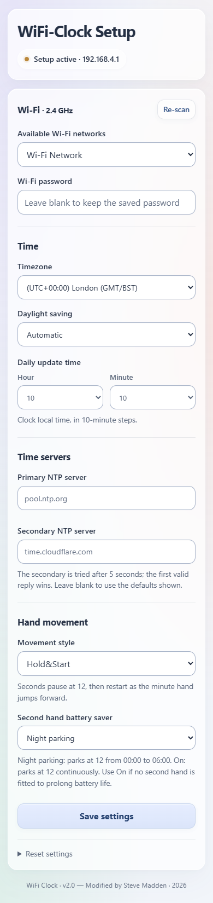

# Setup and operation

## Connect

Hold **REC for three seconds** to wake Wi-Fi. With saved credentials, connect
your phone or computer to the same LAN and open the clock's router-assigned IP.
REC does not erase settings.

With no saved credentials, join **WiFi-Clock-Setup** and open
`http://192.168.4.1/`. Initial provisioning is an open AP; use a trusted environment.
Automatic captive-portal detection and mDNS are not required.

In station mode use the router's DHCP-assigned IP. The hostname is
**WiFi-Clock-ABCDEF**, with the final six MAC hex digits uppercase.
Router DNS registration/display is router-dependent; this is not a promised
`.local` address.

## Wi-Fi

Available Wi-Fi networks displays the saved SSID when one exists, otherwise
**Select a network**. Selecting Manual reveals the text box labelled
**Manually enter Network name (SSID)**.

Use a 2.4 GHz open or WPA2-PSK network. Credentials use supported ASCII input;
SSID is 1–32 bytes and WPA password 8–63 characters (blank for open).
Leaving the password unchanged retains the stored secret; it is not returned
to the browser. Enterprise Wi-Fi is not supported.

## Time

Primary NTP defaults to **pool.ntp.org** and secondary to **time.cloudflare.com**.
After five seconds the second server is tried while the first remains eligible:
the first valid reply wins. Hostnames and IPv4 addresses are supported.

See the [NTP Pool guidance](https://www.ntppool.org/en/use.html) for server names
and regional pools. After synchronisation, [Time.is](https://time.is/) provides
a convenient visual reference for checking the displayed time.

Choose timezone and Automatic, Disabled or Custom rule DST. The Custom POSIX
rule box appears only in Custom rule mode. Fixed offsets and
`Mmonth.week.weekday[/time]` transitions are supported; J/day-number transition
forms are rejected. POSIX offset signs differ from ordinary UTC notation.

Need a custom rule? Use the [Techlogics POSIX timezone generator](https://techlogics.net/electronics/timezone-db.php).
Select your city or timezone, choose **Copy POSIX string**, then select **Custom
rule** in the clock's DST settings and paste it into the **Custom POSIX rule**
box. Copy the POSIX string, not the IANA name (such as Europe/London) or a code
snippet. Check the generated DST dates against your region's current rules;
the generator describes its strings as indicative. Our firmware accepts fixed
offsets and Mmonth.week.weekday transition rules, not J/day-number rules.

For example, the UK rule is `GMT0BST,M3.5.0/1,M10.5.0/2`.

**Next DST change** recalculates from current unsaved selections once the clock
has synchronised time. Preview does not save settings. Disabled DST schedules
no special DST wake. A transition wake is temporary and does not replace the
saved daily update time.

Daily update minutes are **00, 10, 20, 30, 40, 50**. HC32 V15 also supports
minute-resolution special DST wake, including transitions off the full hour.

## Hand movement and battery saving

| Setting | Meaning |
| --- | --- |
| Sweep | Gradual minute-hand steps |
| Burst | Minute-hand jump |
| Hold&Start | Swiss railway station-clock-style movement: seconds pause at 12, then restart as the minute hand jumps forward |
| Second hand battery saver: Off | Normal selected movement, no scheduled parking |
| Night parking | Seconds parked between 00:00 and 06:00 |
| On | Seconds reach 12 and remain parked indefinitely; useful if no second hand is fitted |

[Watch an example of the Hold&Start movement](https://youtube.com/shorts/2L59QxfKAD8)

Defaults are **Sweep + Off** (selector suffix `00`). On does not stop the
minute hand. Original battery checks remain active in the HC32.

## Save and use

### Movement buttons

| Hold for three seconds | Action |
| --- | --- |
| REC | Wake Wi-Fi for access to the settings page |
| RESET | Move all hands to the 12 o'clock reference; settings are retained |
| REC + RESET together | Erase saved Wi-Fi and clock settings |

Before fitting or refitting hands, hold **RESET for three seconds**, wait for
the movement to reach its 12 o'clock reference, then remove power and fit all
hands pointing exactly to 12. If a transport locking pin is fitted, leave it
in place during hand fitting and remove it before powering the movement.

**Save settings** persists the selected configuration. Saving is not a claim that
DNS/NTP has succeeded; check live connection/time status. Network changes can
temporarily make the page unreachable. Rejoin the appropriate network and open
the current IP if necessary.

An active browser page sends a lease refresh, causing WIFIAPPING on the UART
to keep the Wi-Fi chip powered. Closing/leaving the page lets the lease expire;
HC32 controls the eventual power-off. +TIME begins after NTP and repeats while
powered and connected.

Reset clears application settings, not factory radio data. The reset control
is under the expandable **Reset settings** section.

## Security limits

Local HTTP, not HTTPS. Flash settings are CRC-protected, not encrypted.
Per-boot write tokens/origin checks are not user authentication. Do not expose
the page to the Internet or publish credentials/captures/factory data.
